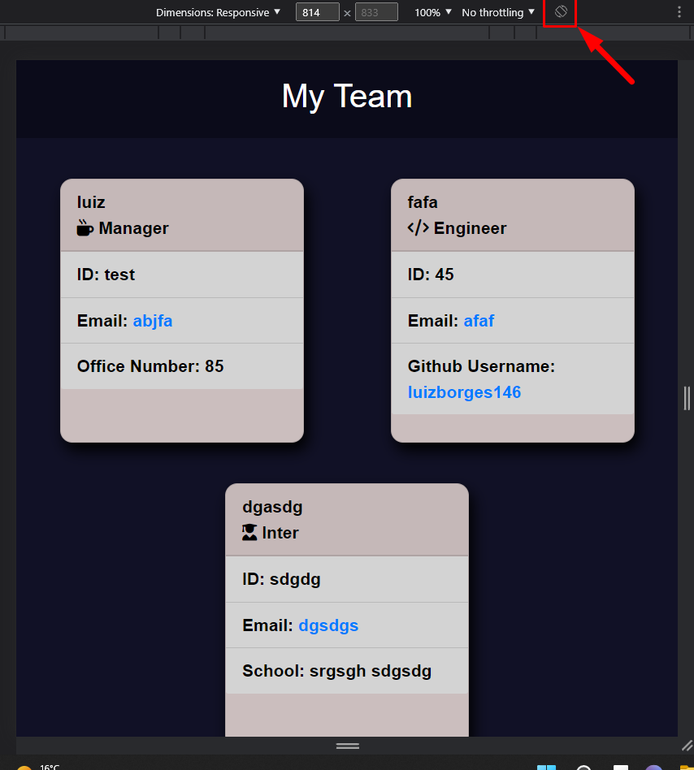

# TEAM PROFILE GENERATOR 

Link to [GitHub repository](https://github.com/luizborges146/team-profile-generator)

Link to [Video](https://drive.google.com/file/d/1FlghDPIYEfP5hZ6Ku1kNH3F6i7B2TFUz/view)


 [](https://opensource.org/licenses/MIT)


    
## Table of Contents
    
1.  [Description](#description)
2.  [Instalation](#instalation)
3.  [Usage Infomration](#usage)
4.  [External support documentation](#externalDoc)
5.  [Tests](#tests)
6.  [Social](#social)
7.  [Plugins](#plugins)
8.  [License](#license)
    
## [Description](#description)
The idea of this application is to organize teams and see which engineers and interns report to the manager. Create a simple and visual interface that will facilitate the user to identify the roles using icons, not only that, create a simple click so if the user wants to contact any employee on the list, it just need to click so the system will auto populate it for the user. The application will describe a Name ID and email for all employee, however, Manager will have one extra field for OFFICE, Engineer for GitHub account, and the Inter will be the school.
    
## [Instalation](#instalation)
N/A    
    
## [Usage](#usage)
Simple and visual access to the team information.
 * Funcitonalities.
   * Display all Name, Email, ID for all users.
   * Email contain a function that will automatically open your email and filled up TO: with the employee email,
   * The engineer GitHub user account is link and it will take you to the engineer profile.
   * Mobile friendly, the picture below was simulated in the user phone.




#### Function below will take the manager infomration that was added in the application, it will add it to template literals and then apply this information on the HTML.
```
    const createManager = manager => {
        let managerArray = 
`
<div class="card">
    <div class="card-header">
        ${manager.name} <br/>
        <i class="fas fa-mug-hot"></i> Manager</div>
    <ul class="list-group list-group-flush">
        <li class="list-group-item">ID: ${manager.id}</li>
        <li class="list-group-item">Email: <span id="email"><a href="mailto:${manager.email}">${manager.email}</a></span></li>
        <li class="list-group-item">Office Number: ${manager.officeNumber}</li>
    </ul>
</div>
`;     
        teamArray.push(managerArray)
    };
```

#### Function below is the menu that will hold the user choice from inquirer prompt and then pass it to the Switch to call the correct function.
```
function menu() {
    inquirer
    .prompt([
        {
            type: "list",
            name:"menu",
            message:"Please, select the type of team member you would like to add:",
            choices:[/*"Manager",*/"Engineer", "Intern","Complete"]
        }
    ])
    .then((userAnswer) => {
        console.log(userAnswer)
        switch(userAnswer.menu) {
            // case "Manager":
            //     addManager();
            //     break;
            case "Engineer":
                addEngineer();
                break;
            case "Intern":
                addIntern();
                break;
            case "Complete":
                createTeam();
        }
    });
}
```
    

## [External support documentation](#externalDoc)
    

- [W3School](https://www.w3schools.com/)<br />
- [Mozilla](https://developer.mozilla.org)<br />
- [READ.me](https://docs.readme.com/docs/linking-to-pages")<br />
- [GitHub](https://pages.github.com/)<br />
- [GitHub Inquirer](https://github.com/SBoudrias/Inquirer.js/blob/master/README.md#installation)
- [Git_cheat_sheet_pdf](https://education.github.com/git-cheat-sheet-education.pdf)<br />
- [npm](https://www.npmjs.com/)<br />
- [Template Literals](https://developer.mozilla.org/en-US/docs/Web/JavaScript/Reference/Template_literals)<br />
- [NodeJs - Path.join](https://nodejs.org/api/path.html#pathjoinpaths)<br />

    
## [Tests](#tests)
N/A
    
## [Social](#social)
if you need any further information or support, please, send an email to: luiz.borges.146@gmail.com
    
[](https://github.com/luizborges146) [](https://www.linkedin.com/in/luiz-borges-2377b7142/)
    
    
    
## [Plugins](#plugins)
N/A
    
## [License](#license)
License Information: [MIT](https://opensource.org/licenses/MIT);

Created by Luiz Borges
Please refer to the LICENSE in the repo.
